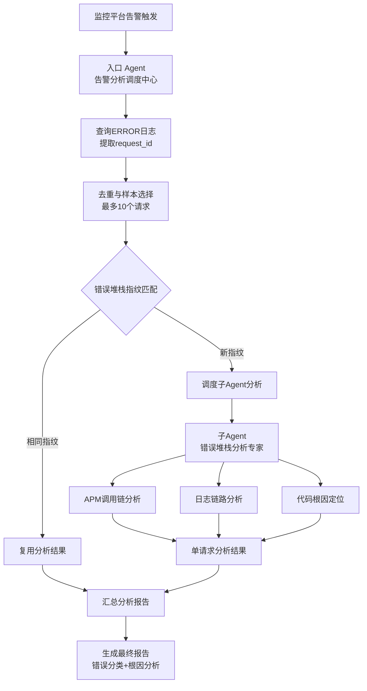

# 蓝鲸作业平台告警分析 Agent

## 依赖声明

> ⚠️ **重要**：本 Agent 依赖以下组件才能正常工作，请确保在使用前已正确配置所有依赖项。

| 依赖类型          | 名称                  | 说明                                                                   |
|---------------|---------------------|----------------------------------------------------------------------|
| **Sub Agent** | `agent-log-analyze` | 日志分析子 Agent，用于对单个请求进行错误堆栈和调用链的深度根因分析                                 |
| **Skill**     | `kql-query-guide`   | KQL 日志查询语法指导，提供 KQL 查询语句编写能力和常用查询模板                                  |
| **MCP**       | 作业平台日志查询 MCP        | 提供 `searchLogsByCondition`、`searchRequestIdByStepInstanceId` 等日志查询工具 |

## 概述

本 Agent 是蓝鲸作业平台（BK-JOB）的 **告警分析调度中心**，专门用于处理监控平台配置的日志类告警策略产生的告警事件。

当监控平台检测到 `count(日志查询语句) >= 阈值` 时触发告警，处理套餐会调用本 Agent 进行深度分析。Agent 会获取错误日志超过阈值的日志查询语句，查询到具体的错误日志列表，然后调用子 Agent 进行错误堆栈和调用链的根因分析，最终汇总生成包含错误分类和根因的完整报告。

## 架构设计

### 整体架构图



### 组件说明

#### 1. 入口 Agent（告警分析调度中心）
- **文件位置**: `prompt-alert-entry.md`
- **职责**: 告警事件的入口处理和调度中心
- **输入**: 监控平台传入的 KQL 日志查询语句（如 `service: "job-execute" AND level: ERROR`）
- **核心功能**:
  - 查询告警时段内的 ERROR 日志
  - 提取并去重所有请求的 `request_id` 列表
  - 建立错误堆栈指纹进行去重
  - 选取最多 10 个代表性请求进行分析
  - 调度子 Agent 进行深度分析
  - 汇总所有分析结果生成最终报告

#### 2. 子 Agent（错误堆栈分析专家）
- **文件位置**: `sub-agent/prompt-error-stack-analysis.md`
- **职责**: 单个请求的深度根因分析
- **输入**: 入口 Agent 传入的单个 `request_id` 和错误日志摘要
- **核心功能**:
  - 通过 APM 查询请求的完整调用链（Trace）
  - 分析错误 Span 和耗时异常 Span
  - 查询该请求的完整链路日志
  - 结合代码进行异常堆栈分析
  - 定位错误根因并分类
  - 输出结构化的单请求分析结论

## 工作流程

### 阶段一：告警接收与预处理
1. **告警触发**: 监控平台检测到 ERROR 日志数量超过阈值
2. **查询语句传入**: 接收 KQL 格式的日志查询语句
3. **日志查询**: 使用 `searchLogsByCondition` 工具查询最近 10 分钟的 ERROR 日志
4. **请求提取**: 从日志中提取所有 `request_id` 并进行去重

### 阶段二：样本选择与去重
1. **错误指纹建立**: 为每个 `request_id` 建立错误堆栈签名
2. **去重跳过**: 相同错误指纹的请求复用已有分析结果
3. **样本选择**: 优先选择不同错误类型的请求，最多选择 10 个样本
4. **时间记录**: 记录每个请求的发生时间用于 APM 查询

### 阶段三：深度分析调度
1. **子 Agent 调度**: 对需要分析的请求逐个调用子 Agent
2. **并行分析**: 支持多个子 Agent 并行分析以提高效率
3. **分析参数传递**: 传入 `request_id`、请求时间、错误日志摘要

### 阶段四：子 Agent 深度分析
1. **APM 调用链分析**: 查询请求的完整 Trace 数据
2. **错误定位**: 识别 Error Span 和耗时异常 Span
3. **日志分析**: 查询该请求的完整链路日志
4. **代码分析**: 结合源代码定位异常抛出点和根因
5. **根因分类**: 确定错误的具体分类和严重程度

### 阶段五：报告汇总
1. **结果收集**: 收集所有子 Agent 的分析结果
2. **分类汇总**: 按根因分类合并相同类型的错误
3. **严重程度评估**: 综合评估整体告警的严重程度
4. **报告生成**: 生成结构化的告警分析报告

## 核心特性

### 1. 智能去重机制
- **错误堆栈指纹**: 基于异常类型和堆栈关键帧建立指纹
- **复用分析**: 相同错误指纹的请求直接复用分析结果
- **效率优化**: 避免对同一类错误进行重复分析

### 2. 样本优化选择
- **类型覆盖**: 优先选择不同错误类型的请求
- **数量控制**: 最多分析 10 个请求，平衡效率与覆盖度
- **代表性**: 确保分析结果能代表整体错误分布

### 3. 多维度分析
- **APM 视角**: 从调用链全局视角定位问题环节
- **日志视角**: 详细分析异常堆栈和业务上下文
- **代码视角**: 结合源代码理解错误产生机制

### 4. 结构化报告
- **根因分类**: 清晰的错误分类体系
- **严重程度**: 客观的严重程度评估
- **建议措施**: 具体的处理建议和解决方案
- **查询链接**: 提供日志平台直接访问链接

## 错误分类体系

### A. 第三方系统/外部接口调用失败
- GSE API 调用失败
- CMDB API 调用失败  
- IAM API 调用失败
- 其他第三方 HTTP 接口调用失败

### B. 内部微服务间调用失败
- job-execute 调用其他微服务失败
- 微服务间通信异常

### C. 中间件异常
- MySQL 连接/操作异常
- RabbitMQ 消息异常
- Redis 操作异常

### D. 用户配置/输入错误
- 脚本参数不合法
- 执行目标配置错误

### E. 系统内部错误
- 空指针异常
- 数据不一致
- 并发冲突

## 技术实现

### 使用的 MCP 工具

#### 入口 Agent 使用
- `searchLogsByCondition`: 查询 ERROR 日志
- `searchRequestIdByStepInstanceId`: 通过 stepInstanceId 查询 request_id（如从 Web 链接提取）

#### 子 Agent 使用
- `search_spans` (bkmonitor-tracing): 查询 APM 调用链
- `searchLogsByCondition`: 查询请求的完整链路日志

### 支持的 Skills
- `apm-trace-analysis`: APM 调用链分析专家
- `kql-query-guide`: 日志查询语法指导
- `task-duration-analysis`: 任务耗时分布分析

## 部署与使用

### 文件结构
```
agent-alert-handle/
├── README.md                 # 本文档
├── prompt-alert-entry.md    # 入口 Agent 提示文件
└── sub-agent/               # 子 Agent 目录
    └── prompt-error-stack-analysis.md  # 错误堆栈分析子 Agent
```

### 调用方式
1. **告警触发**: 监控平台配置告警策略，阈值触发时调用本 Agent
2. **参数传递**: 传入 KQL 日志查询语句
3. **自动分析**: Agent 自动执行完整分析流程
4. **结果返回**: 返回结构化的告警分析报告

### 配置要求
- **时间范围**: 告警分析固定使用 10 分钟时间窗口
- **样本数量**: 最多分析 10 个代表性请求
- **APM 查询**: 需要蓝鲸监控 APM 服务支持
- **日志平台**: 需要访问蓝鲸日志平台权限

## 性能优化

### 查询优化
- **时间窗口控制**: 告警分析使用 10 分钟精确时间范围
- **分页处理**: 支持大数量日志的分页查询
- **精准定位**: 通过 request_id 精确定位单个请求

### 分析优化
- **并行处理**: 支持多个子 Agent 并行分析
- **结果复用**: 相同错误指纹复用分析结果
- **样本控制**: 限制分析数量保证响应速度

### 内存优化
- **增量处理**: 分批处理大量日志数据
- **结果缓存**: 缓存常用查询和分析结果
- **资源释放**: 及时释放不再使用的资源

## 扩展性设计

### 错误分类扩展
- 支持自定义错误分类体系
- 可配置的分类规则和匹配条件
- 动态加载新的错误处理逻辑

### 分析能力扩展
- 插件式分析模块设计
- 支持新增分析维度和工具
- 可配置的分析流程和参数

### 集成扩展
- 支持与其他监控系统集成
- 可配置的数据源和查询接口
- 灵活的告警触发机制

## 注意事项

### 使用限制
- 仅处理 ERROR 级别的日志告警
- 最多同时分析 10 个请求样本
- 需要 APM 和日志平台的访问权限

### 性能考虑
- 大量 ERROR 日志时分析时间可能较长
- 建议设置合理的告警阈值避免频繁触发
- 可配置分析超时时间保证系统稳定性

### 数据安全
- 日志查询仅访问授权范围内的数据
- 分析结果不包含敏感信息
- 支持数据脱敏和权限控制

