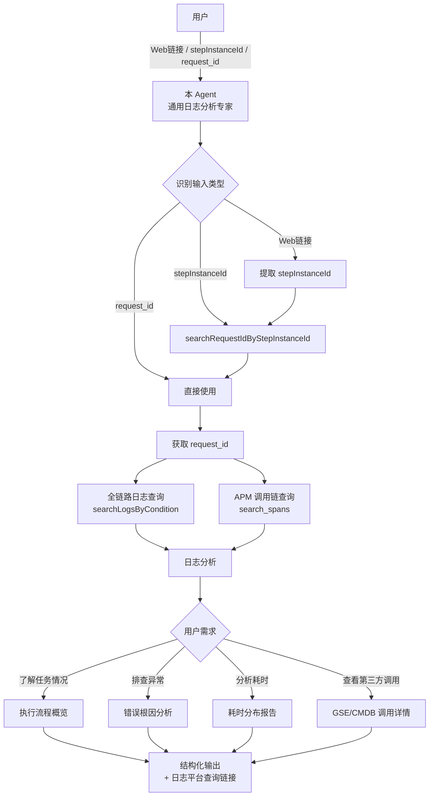

# 蓝鲸作业平台日志分析 Agent

## 依赖声明

> ⚠️ **重要**：本 Agent 依赖以下组件才能正常工作，请确保在使用前已正确配置所有依赖项。

| 依赖类型      | 名称                       | 说明                                                                   |
|-----------|--------------------------|----------------------------------------------------------------------|
| **MCP**   | 作业平台日志查询 MCP             | 提供 `searchLogsByCondition`、`searchRequestIdByStepInstanceId` 等日志查询工具 |
| **MCP**   | 监控平台 Trace 查询 MCP        | 提供 `search_spans` 工具，用于查询 APM 调用链（Trace）数据                           |
| **Rule**  | 快速理解用户的需求                | 识别用户输入的任务标识形式（Web 链接 / stepInstanceId / request_id），自动执行对应的查询流程      |
| **Rule**  | 回答用户时带上日志平台查询链接          | 每次回答都附带日志平台的查询链接，方便用户自行查看完整日志                                        |
| **Skill** | `apm-trace-analysis`     | APM 调用链分析专家，提供 `search_spans` 工具的完整参数说明、filter 语法和分析方法论              |
| **Skill** | `kql-query-guide`        | KQL 日志查询语法指导，提供 KQL 查询语句编写能力和常用查询模板                                  |
| **Skill** | `task-duration-analysis` | 任务耗时分布分析专家，基于六阶段模型分析任务各阶段耗时分布和性能瓶颈                                   |

## 概述

本 Agent 是蓝鲸作业平台（BK-JOB）的 **通用日志分析专家**，面向开发运维人员提供全方位的任务日志查询与分析服务。

与专注于错误堆栈分析的 `agent-error-stack-analyze` 不同，本 Agent 的定位更加通用：

- 📋 **了解任务执行情况**：查看任务的完整执行链路、各阶段状态
- ⏱️ **分析任务耗时分布**：定位性能瓶颈、分析各阶段耗时占比
- 🔍 **排查任务执行异常**：通过日志和 APM 调用链定位错误根因
- 📊 **查询第三方系统调用日志**：查看 GSE/CMDB 等外部系统的调用请求和响应详情

## 核心能力

1. **智能识别用户输入**：自动识别用户提供的任务标识形式（Web 链接、stepInstanceId、request_id），执行对应的查询流程
2. **全链路日志查询**：通过 `request_id` 追踪任务的完整执行链路，覆盖从作业创建到完成的全过程
3. **APM 调用链分析**：通过 `search_spans` 查询请求的 Trace 数据，从全局视角了解服务间调用关系和耗时
4. **任务耗时分布分析**：基于六阶段模型（请求接入 → 准备 → GSE下发 → GSE执行 → 结果处理 → 步骤/作业收尾），生成耗时分布统计报告
5. **第三方系统日志专项查询**：通过 `path` 字段精确匹配 GSE/CMDB 等系统的专用日志，获取完整的请求/响应详情
6. **结构化输出与链接附带**：分析结果以结构化格式输出，并自动附带日志平台查询链接

## 架构设计

### 在整体架构中的位置



## 输入输出

### 输入

支持三种形式的用户输入，Agent 会自动识别并执行对应的查询流程：

| 输入形式               | 示例                                                      | 处理方式                                            |
|--------------------|---------------------------------------------------------|-------------------------------------------------|
| **作业平台 Web 链接**    | `https://job.example.com/...?stepInstanceId=4329876543` | 从 URL 中提取 stepInstanceId → 查询 request_id → 查询日志 |
| **stepInstanceId** | `4329876543`（纯数字）                                       | 调用 searchRequestIdByStepInstanceId → 查询日志       |
| **request_id**     | `b02df4aec7bd263a9b4f727eb605fad9`（字母数字混合）              | 直接查询日志                                          |

### 输出

根据用户需求，输出以下内容：

1. **任务信息摘要**：request_id、任务标识等基本信息
2. **分析报告**：根据用户具体需求（排查异常 / 了解任务情况 / 分析耗时等）输出对应的分析结果
3. **日志平台查询链接**：提供可直接访问的日志平台链接，方便用户自行查看完整日志

## 工作流程

### 步骤一：获取 request_id

根据用户输入类型，自动执行对应的流程获取 `request_id`：

- **Web 链接** → 提取 `stepInstanceId` 参数 → 调用 `searchRequestIdByStepInstanceId`
- **stepInstanceId** → 调用 `searchRequestIdByStepInstanceId`
- **request_id** → 直接使用

### 步骤二：查询全链路日志

使用 `searchLogsByCondition` 查询该 `request_id` 的完整执行链路日志：

```
queryString: request_id: "{request_id}"
timeRange: 7d（有特定 request_id 时可放宽时间范围）
size: 50
```

### 步骤三：按需深入分析

根据用户的具体需求，选择性地进行深入分析：

| 用户需求      | 分析方式                                           |
|-----------|------------------------------------------------|
| 了解任务执行情况  | 按时间顺序遍历日志，梳理执行流程和各阶段状态                         |
| 排查任务执行异常  | 重点关注 ERROR 日志、异常堆栈，结合 APM 调用链定位根因              |
| 分析任务耗时分布  | 使用 `task-duration-analysis` Skill 的六阶段模型进行耗时分析 |
| 查看第三方系统调用 | 使用 `path` 字段精确查询 GSE/CMDB 专用日志                 |

### 步骤四：结构化输出

按照输出规范生成分析报告，并附带日志平台查询链接。

## 常用查询场景

### 查询完整执行链路

```kql
request_id: "{request_id}"
```

### 查询错误日志

```kql
request_id: "{request_id}" AND level: ERROR
```

### 查询 GSE 调用日志

```kql
request_id: "{request_id}" AND path: "*gse.log*"
```

### 查询 CMDB 调用日志

```kql
request_id: "{request_id}" AND path: "*cmdb.log*"
```

> ⚠️ **重要**：查询 GSE/CMDB 调用日志时，必须使用上述标准 `path` 字段查询语句，**禁止**自行编造关键词用 `log: *xxx*` 进行模糊搜索。标准查询能确保获取完整的调用日志（req/resp/异常等），而模糊搜索会遗漏关键信息。

## 使用的 MCP 工具

| 工具                                | MCP 服务                               | 用途                          |
|-----------------------------------|--------------------------------------|-----------------------------|
| `searchLogsByCondition`           | 作业平台日志查询 MCP                         | 通过 KQL 查询语句搜索日志，支持分页和时间范围筛选 |
| `searchRequestIdByStepInstanceId` | 作业平台日志查询 MCP                         | 通过步骤实例 ID 查询对应的 request_id  |
| `search_spans`                    | 监控平台 Trace 查询 MCP（bkmonitor-tracing） | 查询 APM 调用链，获取 Span 列表和调用拓扑  |

## 故障分析维度

当用户需要排查异常时，Agent 会从以下维度进行分析：

| 维度            | 检查点                           | 日志关键字                                       |
|---------------|-------------------------------|---------------------------------------------|
| **用户输入参数问题**  | 脚本参数、目标主机、文件路径、账号权限           | parameter, validation, invalid, parse error |
| **第三方接口调用问题** | GSE/CMDB/IAM 接口调用状态、请求/响应内容   | 使用 `path` 字段查询专用日志                          |
| **中间件异常**     | MySQL 连接、RabbitMQ 消息、Redis 操作 | connection, timeout, pool exhausted         |
| **系统内部错误**    | 空指针、数据不一致、并发冲突                | NullPointerException, IllegalState          |


