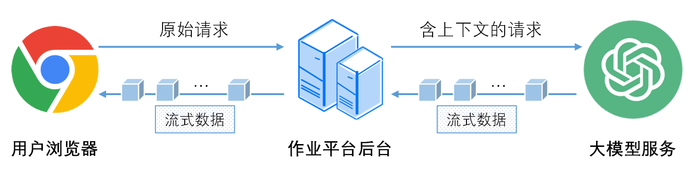
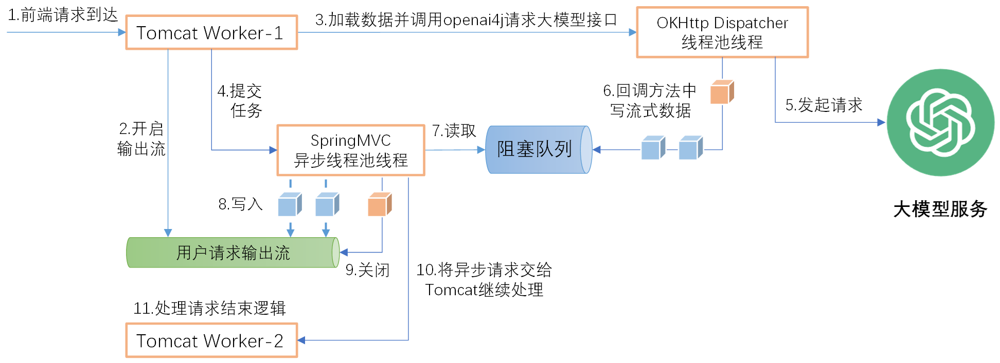

# AI对话流式接口实现技术方案

**（1）流式数据通道建立**  
为了让用户能在页面上及时看到大模型生成的内容，必须在【用户浏览器】-【作业平台后台】-【大模型服务】之间建立一条流式数据通道。其工作原理如下图所示：  

后台一方面需要从大模型服务获取流式数据，另一方面需要将获取到的流式数据及时写入到用户浏览器发起的请求响应中。  
经过调研，采用前端Fetch API分块读取流式数据+后台Spring MVC异步接口来提供流式数据。  
Spring MVC中的异步接口使用单独的异步任务线程池来执行异步任务（调用大模型服务获取流式数据），在异步任务执行过程中可以向响应输出流写入数据，并在异步任务完成后将请求的处理交还给底层Tomcat容器。  
在实现过程中发现，使用openai4j框架调用大模型获取流式数据的过程本身也是异步的，框架使用了OKHttp的Dispatcher线程池发起请求，收到的流式数据通过回调接口的方式传递给调用方（在Dispatcher工作线程中）。要将Dispatcher工作线程收到的数据传递给Spring MVC的异步任务线程，才能及时写入到输出流中传递给浏览器让用户看到。  
因此这里需要用到线程间的数据同步技术，使用JDK并发包中提供的阻塞队列来实现，建立流式数据通道，在收到分块数据后立即将其发送至Web端，延迟P95<2ms，整体技术方案如下图所示：

**（2）流式数据卡顿问题排查解决**  
在部分环境中，我们发现页面上的流式接口需要间隔几秒才能收到一波数据，导致回答内容一批一批地出现几十个字，内容呈现非常不连续，用户体验较差。
经过对比分析与排查，我们发现问题在于请求链路中存在Nginx转发环节，而**Nginx的默认配置中，对于响应内容存在8K的缓冲区**，只有缓冲区写满了才会输出到客户端从而造成卡顿，缓冲区存在的初衷是为了减少IO操作提高传输效率，但它同时也带来了延迟，这对于流式接口并不适用，因此在非正式环境中我们配置关闭该缓冲区，卡顿问题也由此得到解决，在性能要求较高的环境中，可以针对具体的流式接口关闭该缓冲区。
