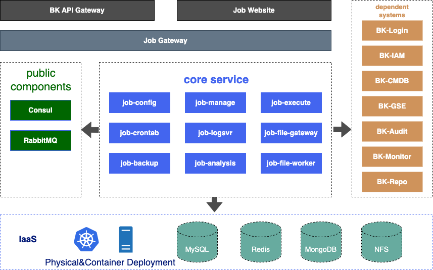

# Blueking (BK-JOB) Architecture Design

English | [简体中文](architecture.md)

## Introduction
The Blueking Job Platform (aka  **bk-job**) is one of the **basic atomic platforms** of Tencent Blueking. Through the **"file pipeline"** and **"command pipeline"** of the BK-GSE , it provides capabilities such as  job orchestration, script execution, and file distribution.

## BK-JOB Architecture

### Frontend

  Features ES6 grammar, MVVM architecture vue.js, and webpack4 package.

### Backend

Written in Java, featuring microservice architecture of Spring Cloud. Here is a brief rundown on each of the microservice modules:

  - **job-config:** Configuration Center: Manages and coordinates the configuration information of all microservices.
  - **job-gateway:** Microservice Gateway: In charge of authentication, traffic throttling, routing requests, etc.
  - **job-manage:** Job Management Microservice: In charge of managing the resources on the platform, including script, account, job template, execution plans, notification, and general settings.
  - **job-execute:** Job Execution Microservice: Serves Blueking GSE by submitting file distribution/script execution tasks, retrieving task logs, and converting task statuses.
  - **job-logsvr:** Log Management Microservice: Connects to the underlying MongoDB. In charge of storing the logs generated from script execution, file distribution, and source file downloading.
  - **job-crontab:** Scheduled Task Microservice. Task scheduling and management of BK-job based on the Quartz engine.
  - **job-backup:** Backup Management Microservice: Imports and exports jobs in bk-job and archives job execution history on a regular basis.
  - **job-analysis:** Statistical Analysis Microservice. Provides backend access to job error message on the main page and operation analysis module; dispatches timed tasks; acquires and analyzes the metadata from other microservices; generates analysis result and statistics; provides data for the operation of bk-job; improves accessibility of the platform.
  - **job-file-gateway:** File Gateway Microservice: Connects with various third party file sources via FileWorker (object-based storage, file system storage, etc.); schedules the file downloading tasks from file source; works with the execution engine to distribute files from third party file source.
  - **job-file-worker:** An access point, an expandable module independent of other bk-job backend microservice; multiple instances can be set up; communicate with the file gateway to connect to various types of third party file sources; executes file downloading tasks.

### Storage And Middleware

  - **Consul:** Phisical deployment only, used as service discovery. You need to build a Consul Server and install Consul on the machine where bk-job microservices are deployed, and run it as Agent.
  - **RabbitMQ:** Core Message Queue Service. Job-execute module uses RabbitMQ to implement a message-based event-driven task scheduling engine.
  - **MySQL:** bk-job's primary database. It store the relational data of job microservices.
  - **Redis:** Distributed Cache. Used for distributed locks and data caching.
  - **MongoDB:**  BK-job's job execution log database. Used to store the log data generated from script execution/file distribution.
  - **NFS:** Used to store user-uploaded local files in local file distribution scenario and store temporary files generated from job import and export.

