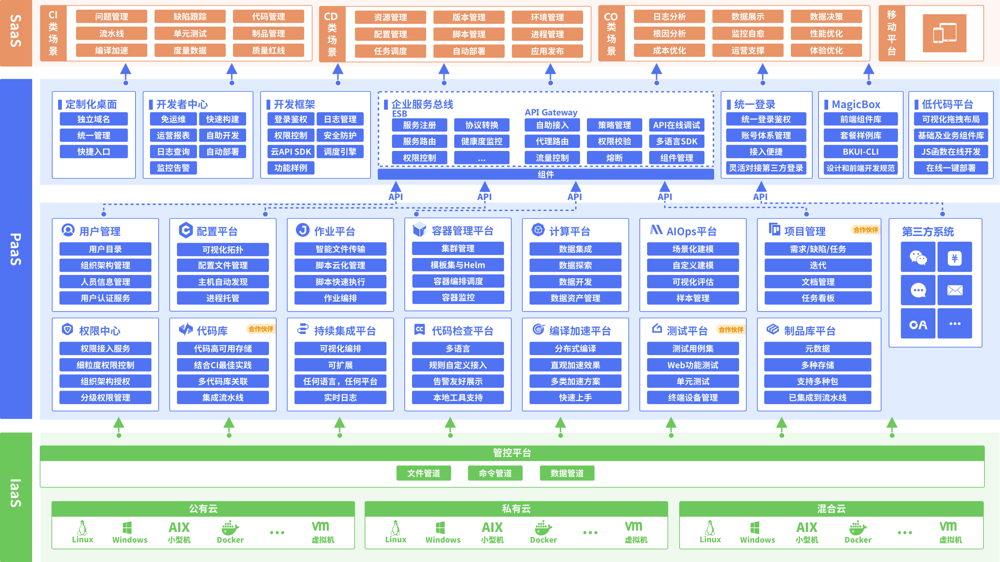

# 蓝鲸作业平台(BK-JOB)架构设计

[English](architecture.en.md) | 简体中文

## 介绍
蓝鲸作业平台(简称**bk-job** )是蓝鲸的**基础原子平台**之一，通过蓝鲸管控平台(GSE)的**“文件管道”和“命令管道”**，提供了作业编排、脚本执行、文件分发等能力。

## 作业平台整体架构

### 前端(FrontEnd)

  使用ES6语法，采用MVVM框架vue.js，通过webpack4打包构建。

### 后端(BackEnd)

基于Java编写，采用主流的SpringBoot+SpringCloud框架的微服务架构设计。以下按各微服务模块进行介绍：

  - **配置中心：** 二进制版本的配置中心，统一管理所有微服务的配置信息。
  - **Job 网关：** 微服务网关，负责认证、限流、请求路由等。
  - **作业管理：** 作业管理微服务，负责管理作业平台中的多种资源，具体包含脚本、账号、作业模板、执行方案、消息通知、全局设置等。
  - **执行引擎：** 作业执行微服务，对接蓝鲸GSE，负责向GSE提交文件分发/脚本执行任务、拉取任务日志、流转任务状态。
  - **执行日志服务：** 日志管理微服务，对接底层MongoDB，负责存储脚本执行、文件分发及文件源文件下载过程中产生的日志。
  - **定时任务：** 定时任务微服务，基于Quartz定时引擎，实现bk-job的定时任务调度与管理。
  - **备份归档：** 备份管理微服务，负责bk-job中的作业导入导出及作业执行流水历史数据的定期归档任务。
  - **统计分析：** 统计分析微服务，为首页异常作业提示与运营分析模块提供后台接口，调度大量定时任务从其他微服务模块获取元数据进行分析与统计，生成分析结果数据与统计数据，为bk-job提供运营数据支撑、提高平台易用性。
  - **文件源网关：** 文件网关微服务，通过与FileWorker通信对接多种不同类型的第三方文件源（如对象存储、文件系统存储等），负责调度文件源文件下载任务，与执行引擎配合完成第三方文件源文件分发。
  - **文件源接入点：** 文件源接入点，独立于其他bk-job后台微服务的可扩展模块，可部署多个实例，与文件网关进行通信，对接不同类型的第三方文件源，是文件下载任务的执行者。

### 存储、基础中间件

  - **Consul：** 仅用于物理部署方式，用作服务发现。需要搭建Consul Server， 以及在bk-job微服务部署的所在机器上同时安装Consul并以 Agent方式运行。
  - **RabbitMQ：** 消息队列服务。作业执行模块使用 RabbitMQ 实现基于消息的事件驱动任务调度引擎
  - **MySQL：** bk-job的主数据库存储，存储微服务的关系型数据。
  - **Redis：** 分布式缓存，用于实现分布式锁、数据缓存等。
  - **MongoDB：** bk-job的作业执行日志数据库，用于存储脚本执行/文件分发过程中产生的日志数据。
  - **NFS：** 一方面用于本地分发文件场景中存储用户上传的本地文件，另一方面用于存储作业导入或导出时生成的临时文件。

