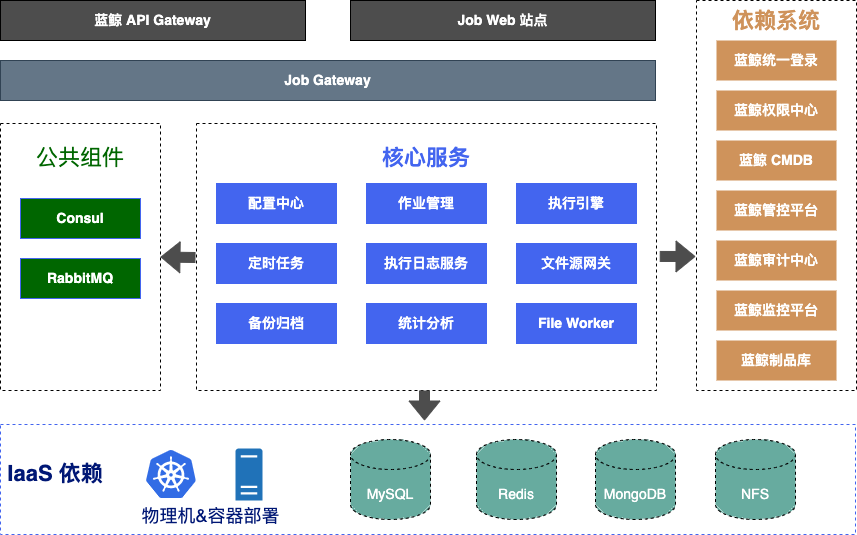

# 蓝鲸作业平台(BK-JOB)架构设计

[English](architecture.en.md) | 简体中文

蓝鲸作业平台(简称**bk-job** )是基于 java/js/html/python/shell/gradle等多种语言编写实现的，采用完全前后端分离，具备高可用可扩展的服务架构设计：

- **前端(FrontEnd) ：**

  使用ES6语法，采用MVVM框架vue.js，通过webpack4打包构建。

- **后端(BackEnd)：** 

基于Java编写，采用SpringCloud框架的微服务架构设计，以下按各微服务模块进行介绍：

  - **job-config：** 配置中心，统一管理所有微服务的配置信息。
  - **job-gateway：** 微服务网关，负责认证、限流、请求路由等。
  - **job-manage：** 作业管理微服务，负责管理作业平台中的多种资源，具体包含脚本、账号、作业模板、执行方案、消息通知、全局设置等。
  - **job-execute：** 作业执行微服务，对接蓝鲸GSE，负责向GSE提交文件分发/脚本执行任务、拉取任务日志、流转任务状态。
  - **job-logsvr：** 日志管理微服务，对接底层MongoDB，负责存储脚本执行、文件分发及文件源文件下载过程中产生的日志。
  - **job-crontab：** 定时任务微服务，基于Quartz定时引擎，实现bk-job的定时任务调度与管理。
  - **job-backup：** 备份管理微服务，负责bk-job中的作业导入导出及作业执行流水历史数据的定期归档任务。
  - **job-analysis：** 统计分析微服务，为首页异常作业提示与运营分析模块提供后台接口，调度大量定时任务从其他微服务模块获取元数据进行分析与统计，生成分析结果数据与统计数据，为bk-job提供运营数据支撑、提高平台易用性。
  - **job-ticket：** 凭据管理微服务，当前主要为文件网关对接的第三方文件源提供不同类型的凭据，负责凭据统一存储与加解密。
  - **job-file-gateway：** 文件网关微服务，通过与FileWorker通信对接多种不同类型的第三方文件源（如对象存储、文件系统存储等），负责调度文件源文件下载任务，与执行引擎配合完成第三方文件源文件分发。
  - **job-file-worker：** 文件源接入点，独立于其他bk-job后台微服务的可扩展模块，可部署多个实例，与文件网关进行通信，对接不同类型的第三方文件源，是文件下载任务的执行者。

- **资源服务层(Resource)：** 包括提供存储和必须的基础中间件等。
    - **Consul：** 用作服务发现Server，需要搭建Consul Server， 以及在bk-job微服务部署的所在机器上同时安装Consul并以 Agent方式运行。
    - **RabbitMQ：** 核心消息队列服务，bk-job的任务执行引擎使用RabbitMQ来传递作业任务状态切换消息。
    - **MySQL：** bk-job的主数据库存储，可用mysql 5.7.2存储以上所有微服务的关系型数据。
    - **Redis：** 核心服务缓存，4.0.14版本，用于提供分布式锁、缓存业务主机信息等。
    - **MongoDB：** bk-job的日志数据库，MongoDB 4.2.2版本，用于存储脚本执行/文件分发过程中产生的日志数据。
    - **NFS：** 一方面用于本地分发文件场景中存储用户上传的本地文件，另一方面用于存储作业导入或导出时生成的临时文件。

