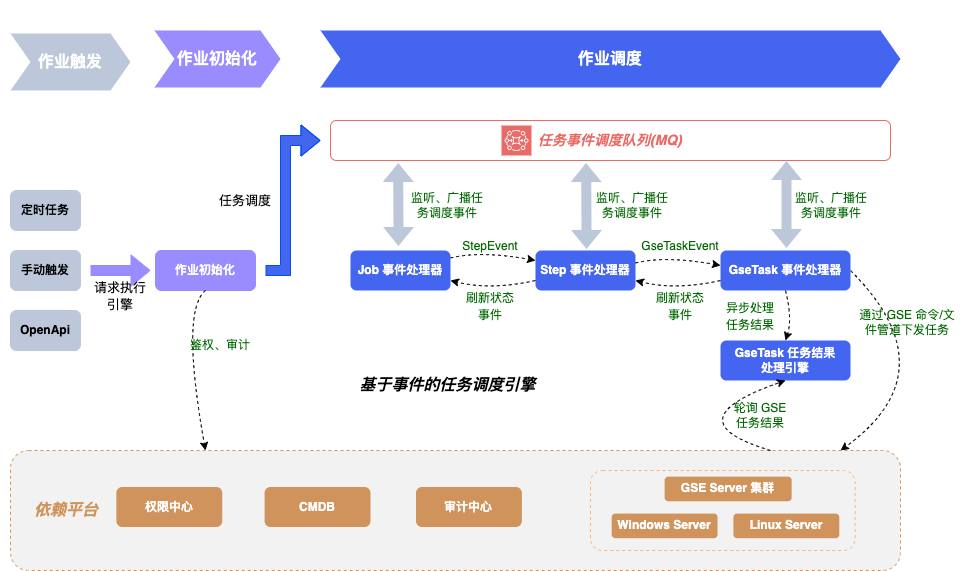

## 介绍

作业执行引擎是作业平台的核心模块，负责作业任务的创建、调度、执行。

用户从 Job Web 页面、定时触发、第三方应用(OpenApi)触发的任务，通过执行引擎调度之后，下发给蓝鲸管控平台（GSE），完成命令执行、文件分发的能力。

## 设计

从执行引擎架构图可以看出，执行引擎基于 **RabbitMQ**， 实现了**基于事件的任务调度引擎**。任务执行的不同阶段触发对应的事件(JobEvent\StepEvent\GseTaskEvent), 驱动对应的**事件处理器**(JobEventHandler\StepEventHandler\GseTaskEventHandler)完成业务逻辑。

### 依赖平台说明
- 权限中心：鉴权
- cmdb: 作业平台使用 cmdb 的资源，比如业务、主机（主机拓扑、动态分组等）、容器（容器拓扑）
- 审计中心：操作审计
- GSE：提供“命令管道”和“文件管道”。作业平台通过GSE Server向执行目标上的GSE Agent下发任务，并从GSE获取任务执行结果
- 制品库：用于存储用户上传的本地文件、应用生成的文件