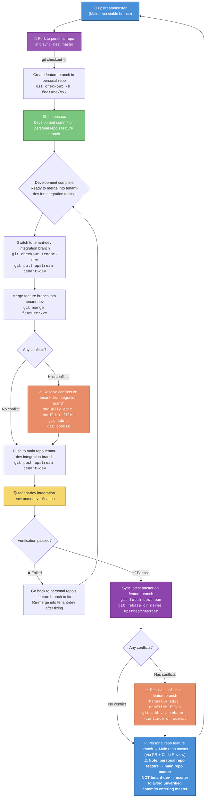

# BK-JOB Git Development Workflow

English | [简体中文](git-workflow.md)

## Overview

This document defines the Git development workflow for the BK-JOB project, aiming to standardize team collaboration, ensure code quality and project stability.

## Fork and Repository Management

BK-JOB adopts the **Fork + Pull Request** collaboration model. Developers need to fork the main repository to their personal GitHub account first. All feature branch development is done in the personal repository, and changes are merged into the main repository's `master` branch via PR.

### Initialize Personal Repository

```shell
# 1. Fork the bk-job main repository to your personal account
# Visit https://github.com/TencentBlueKing/bk-job and click the Fork button in the upper right corner

# 2. Clone your personal repository locally
git clone https://github.com/<your-github-username>/bk-job.git
cd bk-job

# 3. Add the main repository (upstream) as a remote
git remote add upstream https://github.com/TencentBlueKing/bk-job.git

# 4. Verify remote repository configuration
git remote -v
# origin    https://github.com/<your-github-username>/bk-job.git (fetch)
# origin    https://github.com/<your-github-username>/bk-job.git (push)
# upstream  https://github.com/TencentBlueKing/bk-job.git (fetch)
# upstream  https://github.com/TencentBlueKing/bk-job.git (push)
```

### Sync Latest Code from Main Repository

Before creating a feature branch, make sure to sync the latest code from the main repository:

```shell
git fetch upstream
git checkout master
git merge upstream/master
git push origin master
```

## Issue Tracker

The project uses GitHub Issues as the unified platform for requirement management and bug tracking:

👉 **https://github.com/TencentBlueKing/bk-job/issues**

All feature requests, bug reports and improvement suggestions should be tracked via Issues. Before starting development, please check whether a related Issue already exists to avoid duplicate work.

## Branch Management

### Main Branches

| Branch          | Description                                                                                                          | Stability      |
|-----------------|----------------------------------------------------------------------------------------------------------------------|----------------|
| **3.x.x**       | Release branch for each major version, contains production-ready code                                                | ⭐⭐⭐ Highest    |
| **master**      | Main branch, contains the latest version code that has passed development, testing and review, UAT-ready at any time | ⭐⭐ High        |
| **tenant-dev**  | Integration branch, used for multi-feature integration testing and environment verification                          | ⭐ Medium       |
| **feature/xxx** | Feature development branch, created from master, merged back to master when complete                                 | In Development |

### Branch Naming Suggestions

There are no strict requirements for contributor branch naming — just ensure the branch name aligns with the intent of the PR. Here are some common naming patterns for reference:

| Branch Type     | Naming Format                  | Example                  |
|-----------------|--------------------------------|--------------------------|
| Feature branch  | `feature/<short-description>`  | `feature/add-user-auth`  |
| Fix branch      | `fix/<short-description>`      | `fix/login-timeout`      |
| Refactor branch | `refactor/<short-description>` | `refactor/task-executor` |
| Issue related   | `issue_<number>`               | `issue_123`              |

> **Tip**: It is recommended to use lowercase English letters for branch names, with words separated by hyphens `-`. Keep names concise and descriptive so others can easily understand the branch purpose.

## Development Workflow

### Workflow Overview



### Detailed Steps

#### 1. Create Feature Branch

Sync the latest code from the main repository first, then create a feature branch in your **personal repository**:

```shell
# Sync latest code from upstream
git fetch upstream
git checkout master
git merge upstream/master

# Create and switch to feature branch (in your personal repository)
git checkout -b feature/xxx
```

#### 2. Develop and Commit on Feature Branch

Develop and commit on the feature branch. Please follow the [commit convention](./commit-spec.en.md) for commit messages.

```shell
git add .
git commit -m 'feat: add xxx feature #123'
```

#### 3. Merge into tenant-dev Branch for Integration Testing

After development is complete, merge the feature branch into the main repository's `tenant-dev` integration branch for integration testing and environment verification:

```shell
# Switch to tenant-dev branch and pull latest tenant-dev code from upstream
git checkout tenant-dev
git pull upstream tenant-dev

# Merge feature branch into tenant-dev
git merge feature/xxx
```

If conflicts occur, **resolve them on the tenant-dev branch**:

```shell
# Manually edit conflict files and resolve conflicts
git add .
git commit -m 'merge: resolve conflicts merging feature/xxx into tenant-dev'

# Push to main repo's tenant-dev integration branch
git push upstream tenant-dev
```

#### 4. tenant-dev Environment Verification

Perform functional verification and integration testing in the tenant-dev environment:

- ✅ **Verification passed**: Proceed to the next step, submit PR to merge into main repo's master
- ❌ **Verification failed**: Go back to the feature branch in your personal repository to fix issues, then re-merge into the tenant-dev integration branch for verification

#### 5. Sync Latest Master and Resolve Conflicts

After verification passes, before submitting a PR, sync the latest master code from the main repository on your feature branch. During your development, other feature branches may have been merged into master, and submitting a PR directly may cause conflicts.

There are two ways to sync master: `rebase` (recommended) and `merge`. Developers can choose based on their situation.

**Option 1: Using rebase (recommended for simple tasks with fewer commits)**

```shell
# Switch to feature branch
git checkout feature/xxx

# Fetch latest code from upstream and rebase
git fetch upstream
git rebase upstream/master
```

If conflicts occur, resolve them on the feature branch:

```shell
# Manually edit conflict files and resolve conflicts
git add .
git rebase --continue
# If multiple commits have conflicts, repeat the above steps until rebase is complete
```

**Option 2: Using merge (suitable for large tasks with many commits and frequent master syncs)**

```shell
# Switch to feature branch
git checkout feature/xxx

# Fetch latest code from upstream and merge
git fetch upstream
git merge upstream/master
```

If conflicts occur, resolve them on the feature branch:

```shell
# Manually edit conflict files and resolve conflicts
git add .
git commit
```

> 💡 **How to choose**:
> - `rebase` keeps the commit history linear and clean, making Code Review easier. **Recommended for simple tasks with fewer commits.**
> - For large tasks with many commits, especially when you need to sync master frequently and merge into tenant-dev repeatedly for verification, the cost of `rebase` can be high (each rebase may require resolving conflicts commit by commit). In such cases, `merge` is more efficient.
> - **Developers can choose freely based on their actual situation. This is not a mandatory requirement.**

#### 6. Merge into Master (via PR/MR)

After resolving conflicts, push the feature branch from your personal repository to remote, then create a Pull Request on GitHub from **your personal repository's feature branch** to **the main repository (TencentBlueKing/bk-job) `master`**:

```shell
# Push feature branch to your personal remote repository
# If you used rebase to sync master, force push is needed
git push origin feature/xxx --force-with-lease

# If you used merge to sync master, a normal push is sufficient
git push origin feature/xxx
```

Then create a PR on GitHub:
- **Source**: `<your-username>/bk-job` : `feature/xxx`
- **Target**: `TencentBlueKing/bk-job` : `master`

> ⚠️ **Important**: The PR should be from your personal repository's `feature/xxx` → main repository's `master`, **NOT** `tenant-dev` → `master`.
> The `tenant-dev` integration branch is only for integration testing and verification, and should not be merged directly into master. Since the tenant-dev branch may contain code from multiple feature branches, some of which may not have passed verification, merging tenant-dev directly into master would bring **unverified commits into the main branch**. Therefore, PRs must be submitted individually from verified feature branches.

Before submitting a PR, please ensure:

- Consider using `git rebase -i` to clean up commits (refer to [Commit Convention](./commit-spec.en.md)), not mandatory
- Code passes Code Review (refer to [Review Process](./review.en.md))
- Unit tests pass
- Related documentation is updated

## Commit Convention

For detailed commit convention, please refer to: [BK-JOB Commit Convention](./commit-spec.en.md)

### Quick Reference

Commit format:

```
type:message issue
```

| Mark           | Description                                 |
|----------------|---------------------------------------------|
| feat / feature | New feature development                     |
| fix            | Bug fix                                     |
| docs           | Documentation changes                       |
| style          | Code formatting (no business logic changes) |
| refactor       | Code refactoring                            |
| perf           | Performance optimization                    |
| test           | Add/modify test cases                       |
| chore          | Build scripts, tasks and related code       |
| merge          | Branch merge and sync                       |

Examples:

```shell
git commit -m 'feat: add job template import feature #456'
git commit -m 'fix: fix file distribution timeout issue #789'
```

## Important Notes

1. **Never push code directly to the master branch**. All changes must go through PR/MR + Code Review.
2. **The tenant-dev integration branch is only for integration testing and verification**. Do not merge from tenant-dev to master (tenant-dev may contain unverified commits; merging directly into master would compromise the stability of the main branch).
3. Before submitting a PR/MR, consider using `git rebase -i` to squash and organize commits for a clean commit history (not mandatory; use your discretion for large tasks with many commits).
4. Merge conflicts should be resolved on the tenant-dev integration branch. Do not pollute the feature branch.
5. Feature branches should have a short lifecycle. Clean up merged branches promptly.
6. Link Issues: Each commit and PR/MR should reference the corresponding [GitHub Issue](https://github.com/TencentBlueKing/bk-job/issues).

## Related Documents

- [Commit Convention](./commit-spec.en.md)
- [Code Review Process](./review.en.md)
- [Contributing Guide](../../CONTRIBUTING.en.md)
