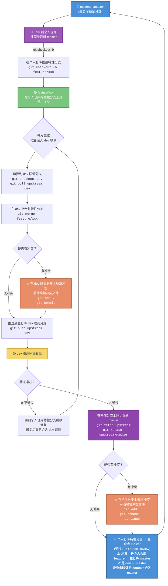

# BK-JOB Git 开发工作流规范

[English](git-workflow.en.md) | 简体中文

## 概述

本文档定义了 BK-JOB 项目的 Git 开发工作流规范，旨在规范团队协作流程，保证代码质量和项目稳定性。

## Fork 与仓库管理

 BK-JOB 采用 **Fork + Pull Request** 的协作模式。开发者需要先将主仓库 Fork 到个人 GitHub 账号下，所有的特性分支开发都在个人仓库中进行，最终通过 PR 从个人仓库的特性分支合入主仓库的 `master` 分支。

### 初始化个人仓库

```shell
# 1. 在 GitHub 上 Fork bk-job 主仓库到个人账号
# 访问 https://github.com/TencentBlueKing/bk-job，点击右上角 Fork 按钮

# 2. 克隆个人仓库到本地
git clone https://github.com/<你的GitHub用户名>/bk-job.git
cd bk-job

# 3. 添加主仓库（upstream）为远程仓库
git remote add upstream https://github.com/TencentBlueKing/bk-job.git

# 4. 验证远程仓库配置
git remote -v
# origin    https://github.com/<你的GitHub用户名>/bk-job.git (fetch)
# origin    https://github.com/<你的GitHub用户名>/bk-job.git (push)
# upstream  https://github.com/TencentBlueKing/bk-job.git (fetch)
# upstream  https://github.com/TencentBlueKing/bk-job.git (push)
```

### 同步主仓库最新代码

在创建特性分支前，务必先同步主仓库的最新代码：

```shell
git fetch upstream
git checkout master
git merge upstream/master
git push origin master
```

## 需求库

项目使用 GitHub Issues 作为统一的需求管理和 Bug 追踪平台：

👉 **https://github.com/TencentBlueKing/bk-job/issues**

所有功能需求、Bug 报告和改进建议都应通过 Issue 进行跟踪管理。在开始开发前，请先确认相关 Issue 是否已存在，避免重复工作。

## 分支管理

### 主要分支说明

| 分支              | 说明                                | 稳定性    |
|-----------------|-----------------------------------|--------|
| **master**      | 主分支（稳定分支），存放随时可发布的代码              | ⭐⭐⭐ 最高 |
| **dev**         | 联调分支，用于多特性集成联调和环境验证               | ⭐⭐ 中等  |
| **feature/xxx** | 特性开发分支，从 master 拉取，开发完成后合入 master | ⭐ 开发中  |

### 分支命名规范

| 分支类型 | 命名格式              | 示例                       |
|------|-------------------|--------------------------|
| 特性分支 | `feature/<简短描述>`  | `feature/add-user-auth`  |
| 修复分支 | `fix/<简短描述>`      | `fix/login-timeout`      |
| 重构分支 | `refactor/<简短描述>` | `refactor/task-executor` |

> **注意**：分支名称使用小写英文字母，单词间用短横线 `-` 分隔，命名应简洁且具有描述性。

## 开发工作流

### 流程概览



### 详细步骤说明

#### 1. 创建特性分支

先同步主仓库最新代码，然后在**个人仓库**中创建特性分支进行开发：

```shell
# 同步主仓库（upstream）最新代码
git fetch upstream
git checkout master
git merge upstream/master

# 创建并切换到特性分支（在个人仓库中）
git checkout -b feature/xxx
```

#### 2. 在特性分支上开发与提交

在特性分支上进行日常开发和提交，提交信息请遵循 [commit 提交规范](./commit-spec.md)。

```shell
git add .
git commit -m 'feat: 新增xxx功能 #123'
```

#### 3. 合入 dev 分支进行联调验证

开发完成后，将特性分支合入主仓库的 `dev` 联调分支进行集成联调和环境验证：

```shell
# 切换到 dev 分支并拉取主仓库最新的 dev 代码
git checkout dev
git pull upstream dev

# 合并特性分支到 dev
git merge feature/xxx
```

如果出现冲突，**在 dev 分支上解决冲突**：

```shell
# 手动编辑冲突文件，解决冲突
git add .
git commit -m 'merge: 解决 feature/xxx 合入 dev 的冲突'

# 推送到主仓库的 dev 联调分支
git push upstream dev
```

#### 4. dev 环境验证

在 dev 联调环境中进行功能验证和集成联调：

- ✅ **验证通过**：进入下一步，提交 PR 合入主仓库 master
- ❌ **验证不通过**：回到个人仓库的特性分支修复问题，修复后重新合入 dev 联调分支验证

#### 5. 同步最新 master 并解决冲突

验证通过后，在提交 PR 之前，先在特性分支上同步主仓库最新的 master 代码。因为在你开发期间，可能已有其他特性分支合入了 master，直接提 PR 可能会产生冲突：

```shell
# 切换到特性分支
git checkout feature/xxx

# 拉取主仓库最新代码并 rebase
git fetch upstream
git rebase upstream/master
```

如果出现冲突，**在特性分支上解决冲突**：

```shell
# 手动编辑冲突文件，解决冲突
git add .
git rebase --continue
# 如有多个 commit 存在冲突，重复上述步骤直到 rebase 完成
```

> 💡 **提示**：使用 `rebase` 而非 `merge` 来同步 master，可以保持特性分支的提交历史线性整洁，便于 Code Review。

#### 6. 合入 master（通过 PR/MR）

解决完冲突后，将个人仓库的特性分支推送到远程，然后在 GitHub 上从 **个人仓库的特性分支** 向 **主仓库（TencentBlueKing/bk-job）的 `master`** 提交 Pull Request：

```shell
# 推送特性分支到个人远程仓库（如果做过 rebase 需要 force push）
git push origin feature/xxx --force-with-lease
```

然后在 GitHub 上创建 PR：
- **Source**：`<你的用户名>/bk-job` : `feature/xxx`
- **Target**：`TencentBlueKing/bk-job` : `master`

> ⚠️ **重要**：PR 是从个人仓库的 `feature/xxx` → 主仓库的 `master`，而**不是** `dev` → `master`。  
> `dev` 联调分支仅用于集成联调验证，不直接合入 master。由于 dev 联调分支可能包含多个特性分支的代码，其中部分可能尚未通过验证，直接从 dev 合入 master 会导致**未验证的 commit 被带入主分支**，因此必须从经过验证的特性分支单独提交 PR。

提交 PR 前请确保：

- 使用 `git rebase` 精简 commit（参考 [commit 提交规范](./commit-spec.md)）
- 代码通过 Code Review（参考 [Review 流程](./review.md)）
- 单元测试通过
- 相关文档已更新

## Commit 提交规范

详细的 Commit 提交规范请参阅：[BK-JOB Commit 提交规范](./commit-spec.md)

### 快速参考

提交格式：

```
type:message issue
```

| 标记             | 说明             |
|----------------|----------------|
| feat / feature | 新功能开发          |
| fix            | Bug 修复         |
| docs           | 文档更改           |
| style          | 代码格式化（不影响业务逻辑） |
| refactor       | 代码重构           |
| perf           | 性能优化           |
| test           | 添加/修改测试用例      |
| chore          | 构建脚本、任务等相关代码   |
| merge          | 分支合并同步         |

示例：

```shell
git commit -m 'feat: 新增作业模板导入功能 #456'
git commit -m 'fix: 修复文件分发超时问题 #789'
```

## 注意事项

1. **严禁直接向 master 分支推送代码**，所有变更必须通过 PR/MR + Code Review 合入
2. **dev 联调分支仅用于集成联调验证**，不要从 dev 分支向 master 合并（dev 中可能包含未验证的 commit，直接合入 master 会破坏主分支稳定性）
3. 提交 PR/MR 前，建议使用 `git rebase -i` 合并整理 commit，保持提交历史清晰
4. 合并冲突应在 dev 联调分支上解决，不要污染特性分支
5. 特性分支的生命周期应尽量短，完成后及时清理已合并的分支
6. 关联 Issue：每次提交和 PR/MR 都应关联对应的 [GitHub Issue](https://github.com/TencentBlueKing/bk-job/issues)

## 相关文档

- [Commit 提交规范](./commit-spec.md)
- [Code Review 流程](./review.md)
- [贡献指南](../../CONTRIBUTING.md)
